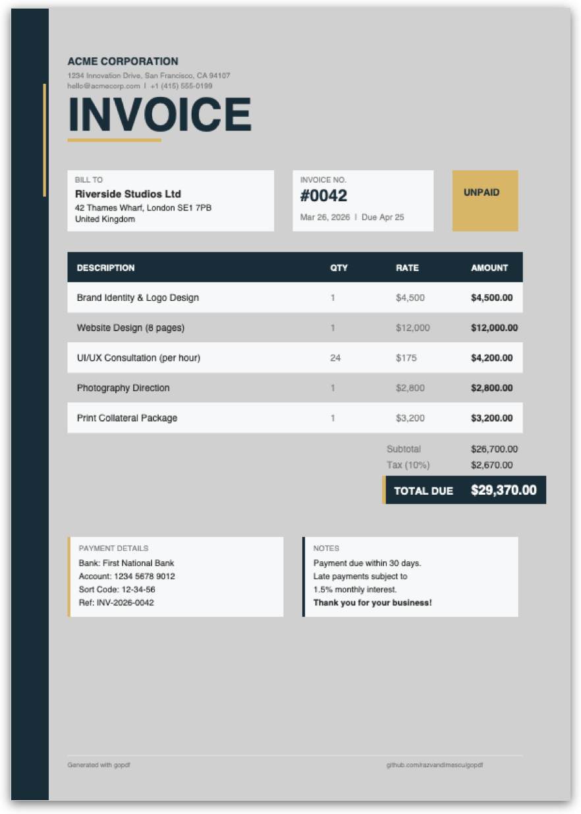
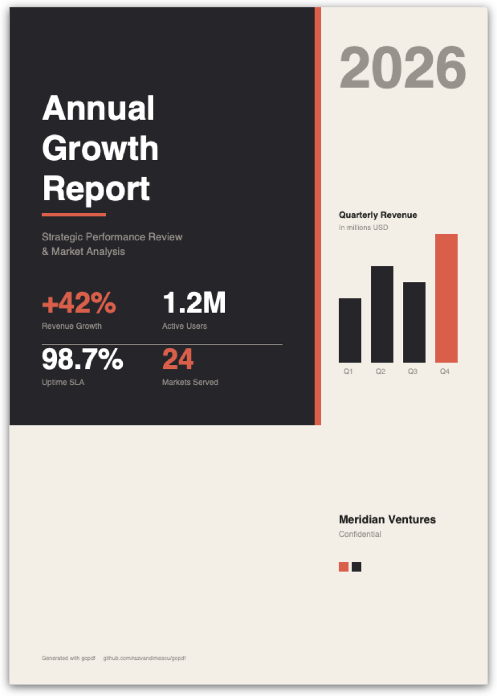

# gopdf

[](https://github.com/razvandimescu/gopdf/actions/workflows/ci.yml)
[](https://pkg.go.dev/github.com/razvandimescu/gopdf/pdf)
[](https://goreportcard.com/report/github.com/razvandimescu/gopdf)
[](LICENSE)

Pure Go library for PDF text extraction, table detection, creation, merging, search, and editing — no CGo, no external dependencies.

<p align="center">
  
  
</p>
<p align="center"><em>Generated entirely from Go code — <code>go run ./cmd/sample/</code></em></p>

Extract text with accurate spatial positioning and font metadata. Detect and extract tables with column/row structure. Create PDFs with text, shapes, and multiple fonts. Search with bounding rectangles. Merge files with page selection. Overlay text and redact regions. All from a single, MIT-licensed package with zero dependencies outside the Go standard library.

## Why gopdf?

If you need to create, read, search, or edit PDFs in Go without CGo or AGPL licensing constraints, gopdf is the only option that combines PDF creation, positioned text extraction, table detection, search with bounding rectangles, merge, overlay, and redaction in a single zero-dependency MIT-licensed package.

| | gopdf | unipdf | pdfcpu | ledongthuc/pdf | MuPDF bindings |
|---|---|---|---|---|---|
| **License** | MIT | AGPL / Commercial | Apache-2.0 | BSD-3 | AGPL |
| **CGo required** | No | No | No | No | Yes |
| **Text extraction** | Positioned (X/Y) | Positioned | Raw streams | Basic | Positioned |
| **Table detection** | Yes | No | No | No | No |
| **Text search** | With rects | Yes | No | No | Yes |
| **PDF merge** | Yes | Yes | Yes | No | No |
| **Text overlay** | Yes | Yes | Watermark | No | No |
| **Visual redaction** | Yes | Yes | No | No | No |
| **PDF creation** | Yes | Yes | Yes | No | Yes |
| **Encryption** | No | Yes | Yes | No | Yes |
| **Dependencies** | 0 | Many | 0 | 0 | System lib |

## Features

- Text extraction with X/Y coordinates, font name, and font size
- Line reconstruction with intelligent spacing
- Table detection with column/row extraction (explicit headers or auto-detection)
- Multi-page table support with automatic header re-detection
- Text search returning bounding rectangles
- PDF merge with page selection
- Text overlay (Helvetica, configurable size and color)
- Visual redaction (filled rectangles with configurable color)
- PDF creation with text, rectangles, lines, and multiple fonts
- Pure Go — no CGo, no system dependencies

## Installation

```bash
go get github.com/razvandimescu/gopdf@latest
```

## Quick Start

```go
package main

import (
    "fmt"
    "log"

    "github.com/razvandimescu/gopdf/pdf"
)

func main() {
    doc, err := pdf.OpenFile("document.pdf")
    if err != nil {
        log.Fatal(err)
    }
    text, err := doc.Text()
    if err != nil {
        log.Fatal(err)
    }
    fmt.Println(text)
}
```

## Examples

### Positioned text lines

```go
doc, err := pdf.OpenFile("document.pdf")
if err != nil {
    log.Fatal(err)
}
for i := 0; i < doc.NumPages(); i++ {
    lines, _ := doc.Page(i).TextLines()
    for _, line := range lines {
        fmt.Printf("Y=%.0f: %s\n", line.Y, line.Text)
    }
}
// Output:
// Y=756: Quotation Ref: QT10001
// Y=732: Quote Name: Northgate Academy
// Y=710: Company: Nova Facilities
// ...
```

### Table extraction

```go
// Auto-detect tables (no header hints needed)
tables, _ := doc.Page(0).Tables()
for _, tbl := range tables {
    for _, col := range tbl.Columns {
        fmt.Printf("%-20s", col.Name)
    }
    fmt.Println()
    for _, row := range tbl.Rows {
        for _, cell := range row.Cells {
            fmt.Printf("%-20s", cell.Text)
        }
        fmt.Println()
    }
}
```

With explicit header anchors (more precise):

```go
spans, _ := doc.Page(0).TextSpans()
tbl := pdf.FindTable(spans, &pdf.TableOpts{
    Headers: []string{"Quantity", "Description"},
})
fmt.Println(tbl.CellByName(0, "Quantity"))    // "3"
fmt.Println(tbl.CellByName(0, "Description")) // "Widget Assembly"
```

Multi-page tables:

```go
var pages [][]pdf.TextSpan
for i := 0; i < doc.NumPages(); i++ {
    spans, _ := doc.Page(i).TextSpans()
    pages = append(pages, spans)
}
tbl := pdf.FindTableAcrossPages(pages, &pdf.TableOpts{
    Headers: []string{"Date", "Amount"},
})
// All rows across all pages in a single table
fmt.Printf("%d rows\n", len(tbl.Rows))
```

### Search for text

```go
results := doc.Search("Invoice Total")
for _, r := range results {
    fmt.Printf("Page %d at (%.0f, %.0f) size %.0fx%.0f\n",
        r.Page, r.Rect.X, r.Rect.Y, r.Rect.Width, r.Rect.Height)
}
// Output:
// Page 0 at (206, 691) size 70x12
```

### Merge PDFs

```go
combined, err := pdf.MergeFiles("a.pdf", "b.pdf", "c.pdf")
if err != nil {
    log.Fatal(err)
}
os.WriteFile("merged.pdf", combined, 0644)
```

With page selection:

```go
m := pdf.NewMerger()
m.AddFile("big.pdf", 0, 2, 5) // pages 0, 2, 5 only
m.Add(otherPDFBytes)           // all pages
result, err := m.Merge()
```

### Create a PDF from scratch

```go
c := pdf.NewCreator()
page := c.NewPage(595, 842) // A4

page.SetFont("Helvetica-Bold", 24)
page.DrawText(72, 750, "Invoice #12345")

page.SetFont("Helvetica", 12)
page.DrawText(72, 720, "Date: 2026-03-26")
page.DrawText(72, 704, "Total: $500.00")

page.FillRect(72, 690, 200, 1, 0, 0, 0) // separator line

data, err := c.Build()
os.WriteFile("invoice.pdf", data, 0644)
```

### Text overlay

```go
ed := pdf.NewEditor(data)
ed.AddText(pdf.TextOverlay{
    Page: 0, X: 100, Y: 50,
    Text: "APPROVED", FontSize: 24,
    R: 0, G: 0.5, B: 0, // green
})
result, err := ed.Apply()
```

### Redaction

```go
ed := pdf.NewEditor(data)
ed.RedactText("Confidential", 0, 0, 0) // black box over all matches
result, err := ed.Apply()
```

Combine redaction and overlay to replace text:

```go
ed := pdf.NewEditor(data)
ed.RedactText("OLD-REF", 1, 1, 1)       // white box over old text
ed.AddText(pdf.TextOverlay{              // write new text
    Page: 0, X: 100, Y: 750,
    Text: "NEW-REF", FontSize: 12,
})
result, err := ed.Apply()
```

## API Reference

### Document

| Method | Returns | Description |
|---|---|---|
| `pdf.OpenFile(path)` | `*Document, error` | Open PDF from file |
| `pdf.OpenBytes(data)` | `*Document, error` | Open PDF from bytes |
| `doc.NumPages()` | `int` | Page count |
| `doc.Page(n)` | `*Page` | Page by 0-based index |
| `doc.Text()` | `string, error` | All text, pages joined by newline |
| `doc.Search(query)` | `[]SearchResult` | Find text across all pages |

### Page

| Method | Returns | Description |
|---|---|---|
| `page.Text()` | `string, error` | Full page text |
| `page.TextLines()` | `[]TextLine, error` | Lines grouped by Y, sorted top-to-bottom |
| `page.TextSpans()` | `[]TextSpan, error` | Raw positioned spans |
| `page.Tables()` | `[]Table, error` | Auto-detect all tables |
| `page.FindTable(opts)` | `*Table, error` | Detect table with options |
| `page.Search(query)` | `[]SearchResult` | Find text on this page |
| `page.Rotation()` | `int` | Rotation in degrees (0/90/180/270) |
| `page.MediaBox()` | `[4]float64` | Page bounds [llx, lly, urx, ury] |

### Creator

| Method | Returns | Description |
|---|---|---|
| `pdf.NewCreator()` | `*Creator` | Create empty PDF builder |
| `c.NewPage(w, h)` | `*PageBuilder` | Add blank page (points) |
| `c.Build()` | `[]byte, error` | Produce PDF bytes |
| `page.SetFont(name, size)` | | Set font (Helvetica, Times, Courier + variants) |
| `page.SetColor(r, g, b)` | | Set fill color (0-1) |
| `page.DrawText(x, y, text)` | | Draw text at position |
| `page.DrawRect(x, y, w, h)` | | Stroked rectangle |
| `page.FillRect(x, y, w, h, r, g, b)` | | Filled rectangle |
| `page.DrawLine(x1, y1, x2, y2, w)` | | Line with width |
| `page.TextWidth(text)` | `float64` | Measure text width in current font |

### Merger

| Method | Returns | Description |
|---|---|---|
| `pdf.MergeFiles(paths...)` | `[]byte, error` | Merge PDF files by path |
| `pdf.MergeBytes(pdfs...)` | `[]byte, error` | Merge in-memory PDFs |
| `pdf.NewMerger()` | `*Merger` | Create merger for page selection |
| `m.AddFile(path, pages...)` | `error` | Add file (0-indexed pages; empty = all) |
| `m.Add(data, pages...)` | `error` | Add bytes (0-indexed pages; empty = all) |
| `m.Merge()` | `[]byte, error` | Produce combined PDF |

### Table Detection

| Method | Returns | Description |
|---|---|---|
| `pdf.FindTable(spans, opts)` | `*Table` | Detect single table from spans |
| `pdf.FindTables(spans, opts)` | `[]Table` | Detect all tables (auto-detect) |
| `pdf.FindTableAcrossPages(pages, opts)` | `*Table` | Detect table spanning multiple pages |
| `tbl.CellText(row, col)` | `string` | Cell text by row/col index |
| `tbl.ColumnByName(name)` | `int` | Column index by name (case-insensitive) |
| `tbl.CellByName(row, name)` | `string` | Cell text by row index and column name |

`TableOpts` fields: `Headers` (anchor strings), `YTolerance`, `MinColumns`, `RowFilter`, `WrapTolerance`, `MinGap`.

### Editor

| Method | Returns | Description |
|---|---|---|
| `pdf.NewEditor(data)` | `*Editor` | Create editor from PDF bytes |
| `pdf.NewEditorFromFile(path)` | `*Editor, error` | Create editor from file |
| `ed.AddText(overlay)` | | Draw text (Helvetica, any size/color) |
| `ed.Redact(region)` | | Cover area with filled rectangle |
| `ed.RedactText(query, r, g, b)` | `error` | Search and redact all matches |
| `ed.Apply()` | `[]byte, error` | Produce modified PDF |

### Types

```go
type TextSpan struct {
    X, Y     float64 // position on page
    EndX     float64 // X position after this span
    FontSize float64
    Font     string
    Text     string
}

type TextLine struct {
    Y     float64
    Spans []TextSpan
    Text  string // reconstructed line text with spacing
}

type Table struct {
    Columns []Column
    Rows    []Row
}

type Column struct {
    Name string
    X    float64
}

type Row struct {
    Y     float64
    Cells []Cell
}

type Cell struct {
    Column int // index into Table.Columns
    Text   string
    Spans  []TextSpan
}

type SearchResult struct {
    Page     int
    Text     string
    Rect     Rect
    FontSize float64
}

type Rect struct {
    X, Y, Width, Height float64
}
```

## Supported PDF Features

| Category | Details |
|---|---|
| **PDF versions** | 1.0–1.7, including xref streams (1.5+) and compressed object streams |
| **Text encodings** | ToUnicode CMaps (bfchar + bfrange), WinAnsi, MacRoman, encoding differences, Adobe Glyph List (4200 names) |
| **Font types** | Type1, TrueType, CIDFont/Type0 composite fonts, standard 14 fonts with built-in width tables |
| **Compression** | FlateDecode, LZWDecode, ASCII85Decode, ASCIIHexDecode, PNG predictors, filter chains |
| **Page features** | Resource inheritance from page tree, rotation (0/90/180/270), MediaBox/CropBox |
| **Content streams** | All text operators (BT/ET/Tf/Tm/Td/TD/T\*/TJ/Tj/'/"), graphics state stack (q/Q), CTM (cm) |
| **XObjects** | Recursive text extraction from Form XObjects via Do operator |
| **Marked content** | ActualText extraction (BMC/BDC/EMC) with UTF-16BE support |
| **Structure** | Linearized PDFs, incremental updates, indirect Length references |

## Limitations

- No encryption/password support (planned)
- No image extraction
- PDF creation supports standard 14 fonts only (no font embedding)
- Merge drops interactive features (forms, bookmarks, JS)
- Redaction is visual only (rectangle drawn over text, not removed from stream)
- Text overlay uses Helvetica only

## Architecture

```
pdf/
  document.go   Public API (Document, Page)
  reader.go     PDF structure: xref, streams, object resolution, fonts, CMap
  text.go       Content stream -> positioned text spans -> line reconstruction
  table.go      Table detection: header anchors, gap-based auto-detect, multi-page
  writer.go     PDF object serializer, xref generation, FlateDecode compression
  merge.go      PDF merge: deep object copy with ref remapping, page tree construction
  edit.go       Text search, text overlay, visual redaction
  creator.go    PDF creation from scratch (text, shapes, fonts)
  lexer.go      PDF byte stream tokenizer
  parser.go     Token -> object parser (dicts, arrays, refs)
  objects.go    Types: Dict, Array, Name, Ref, Stream; matrix math helpers
  glyphlist.go  Adobe Glyph List (generated, 4200 entries)
  stdfonts.go   Standard 14 font width tables
```

## License

MIT — see [LICENSE](LICENSE).
