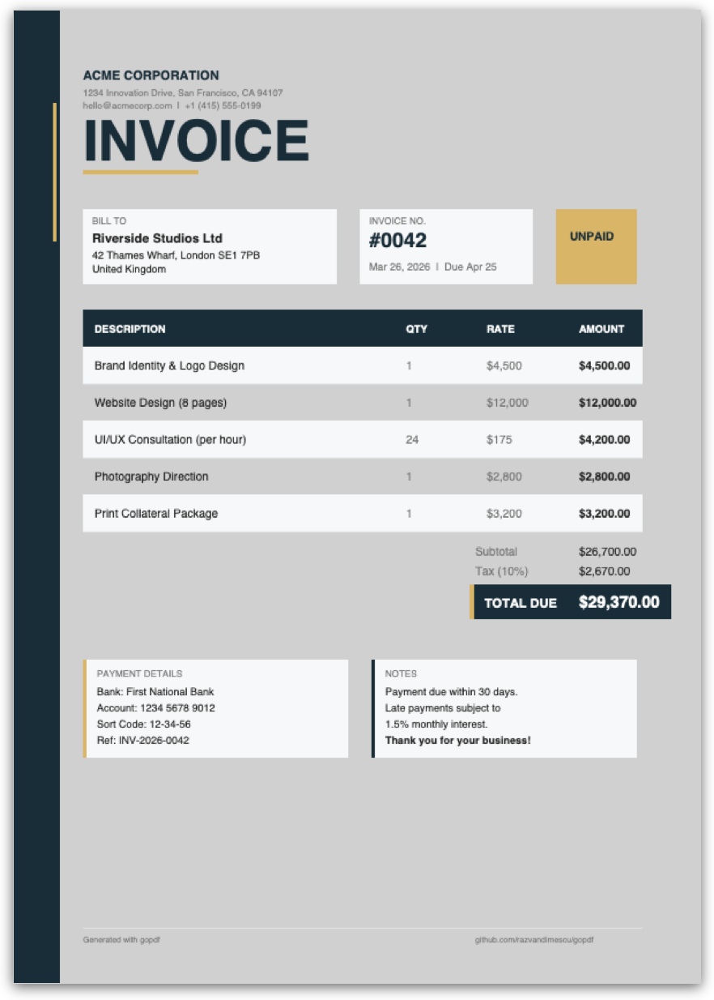
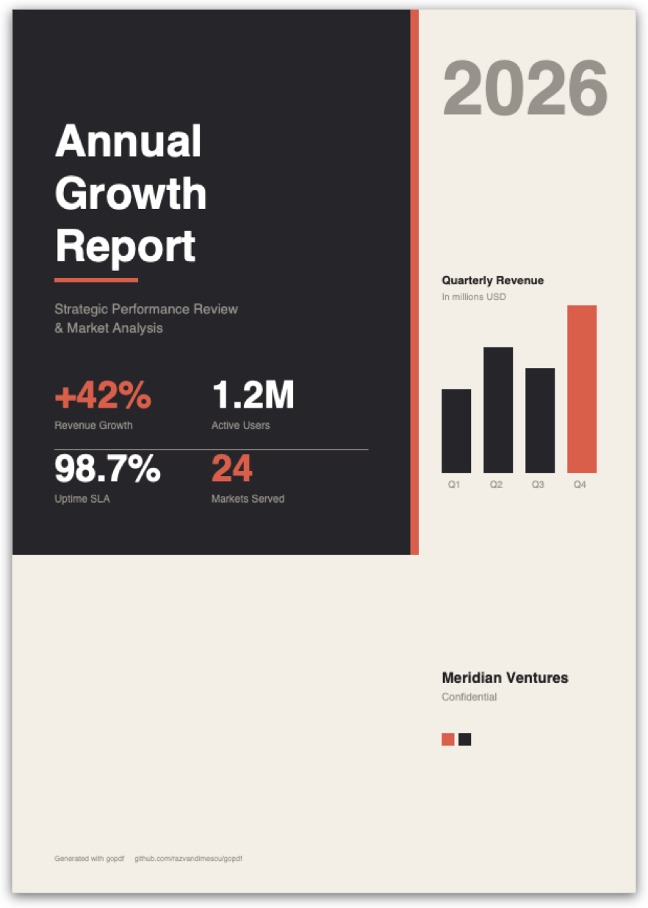

# gopdf

[](https://github.com/razvandimescu/gopdf/actions/workflows/ci.yml)
[](https://pkg.go.dev/github.com/razvandimescu/gopdf/pdf)
[](https://goreportcard.com/report/github.com/razvandimescu/gopdf)
[](https://codecov.io/gh/razvandimescu/gopdf)
[](LICENSE)

Pure Go table extraction from PDFs — plus positioned text, search, creation, merge, and editing. No CGo, no AGPL, no dependencies outside the standard library.

<p align="center">
  
  
</p>
<p align="center"><em>Generated entirely from Go code — <code>go run ./cmd/sample/</code></em></p>

Getting structured rows and columns out of an invoice, bank statement, or report normally means shelling out to `pdftotext -layout` and regexing the columns back together, or leaving Go for Python's camelot/tabula. `gopdf` does it natively: tables are located by header anchors or auto-detected from column gaps, with multi-line cell merging and multi-page continuation.

```go
doc, _ := pdf.OpenFile("statement.pdf")
tables, _ := doc.Page(0).Tables()
fmt.Println(tables[0].CellByName(0, "Amount")) // "1,204.50"
```

## Why gopdf?

Table extraction in pure Go, under a permissive licence. [unipdf](https://github.com/unidoc/unipdf) extracts tables too, but is AGPL or commercial. [ledongthuc/pdf](https://github.com/ledongthuc/pdf) gives you positioned text and groups it into rows and columns, but has no header anchoring, multi-line cell merging, or multi-page continuation.

| | gopdf | unipdf | pdfcpu | ledongthuc/pdf | MuPDF bindings |
|---|---|---|---|---|---|
| **License** | MIT | AGPL / Commercial | Apache-2.0 | BSD-3 | AGPL |
| **CGo required** | No | No | No | No | Yes |
| **Text extraction** | Positioned (X/Y) | Positioned | Raw streams | Positioned (X/Y) | Positioned |
| **Table detection** | Yes | Yes | No | Row/column grouping | No |
| **Text search** | With rects | Yes | No | No | Yes |
| **PDF merge** | Yes (size-constrained) | Yes | Yes | No | No |
| **Text overlay** | Yes | Yes | Watermark | No | No |
| **Visual redaction** | Yes | Yes | No | No | No |
| **PDF creation** | Yes | Yes | Yes | No | Yes |
| **Reads encrypted PDFs** | Yes | Yes | Yes | No | Yes |
| **Dependencies** | 0 | Many | 0 | 0 | System lib |

### When to use something else

- **[pdfcpu](https://github.com/pdfcpu/pdfcpu)** — for document operations as your primary need: encryption, form filling, optimization, page manipulation, or a batch CLI. It is more mature and more broadly tested than gopdf on all of them.
- **[unipdf](https://github.com/unidoc/unipdf)** — for breadth and commercial support, if AGPL or a paid licence works for you.
- **[go-pdf/fpdf](https://github.com/go-pdf/fpdf)** — for generating documents with embedded fonts and rich layout. gopdf's creator covers the standard 14 fonts only.
- **MuPDF bindings** — for rendering fidelity, if CGo and AGPL are acceptable.

## Features

- Table detection with column/row extraction (explicit headers or auto-detection)
- Multi-line cell merging for tables with wrapped content (bank statements, invoices)
- Multi-page table support with automatic header re-detection
- Text extraction with X/Y coordinates, font name, and font size
- Line reconstruction with gap-derived word spacing
- Text search returning bounding rectangles
- PDF merge with page selection and size constraints (fail/truncate/shrink with JPEG recompression)
- Text overlay (Helvetica, configurable size and color)
- Visual redaction (filled rectangles with configurable color)
- Reads encrypted PDFs (RC4 40/128-bit, AES-128, AES-256; user or owner password)
- Image overlay / watermark (PNG/JPEG, rotation, opacity, transparent SMask)
- PDF creation with text, rectangles, lines, and multiple fonts
- Pure Go — no CGo, no system dependencies

## Installation

```bash
go get github.com/razvandimescu/gopdf@latest
```

## Quick Start

```go
package main

import (
    "fmt"
    "log"

    "github.com/razvandimescu/gopdf/pdf"
)

func main() {
    doc, err := pdf.OpenFile("document.pdf")
    if err != nil {
        log.Fatal(err)
    }
    text, err := doc.Text()
    if err != nil {
        log.Fatal(err)
    }
    fmt.Println(text)
}
```

## Examples

### Positioned text lines

```go
doc, err := pdf.OpenFile("document.pdf")
if err != nil {
    log.Fatal(err)
}
for i := 0; i < doc.NumPages(); i++ {
    lines, _ := doc.Page(i).TextLines()
    for _, line := range lines {
        fmt.Printf("Y=%.0f: %s\n", line.Y, line.Text)
    }
}
// Output:
// Y=756: Quotation Ref: QT10001
// Y=732: Quote Name: Northgate Academy
// Y=710: Company: Nova Facilities
// ...
```

### Table extraction

```go
// Auto-detect tables (no header hints needed)
tables, _ := doc.Page(0).Tables()
for _, tbl := range tables {
    for _, col := range tbl.Columns {
        fmt.Printf("%-20s", col.Name)
    }
    fmt.Println()
    for _, row := range tbl.Rows {
        for _, cell := range row.Cells {
            fmt.Printf("%-20s", cell.Text)
        }
        fmt.Println()
    }
}
```

With explicit header anchors (more precise):

```go
spans, _ := doc.Page(0).TextSpans()
tbl := pdf.FindTable(spans, &pdf.TableOpts{
    Headers: []string{"Quantity", "Description"},
})
fmt.Println(tbl.CellByName(0, "Quantity"))    // "3"
fmt.Println(tbl.CellByName(0, "Description")) // "Widget Assembly"
```

Tables with multi-line cells (e.g., bank statements):

```go
tbl := pdf.FindTable(spans, &pdf.TableOpts{
    Headers:   []string{"Date", "Description", "Debit", "Credit"},
    MergeGap:  16,  // merge rows within 16pt into one logical row
    MaxRowGap: 30,  // stop table when gap exceeds 30pt (footer boundary)
})
```

Multi-page tables:

```go
var pages [][]pdf.TextSpan
for i := 0; i < doc.NumPages(); i++ {
    spans, _ := doc.Page(i).TextSpans()
    pages = append(pages, spans)
}
tbl := pdf.FindTableAcrossPages(pages, &pdf.TableOpts{
    Headers: []string{"Date", "Amount"},
})
// All rows across all pages in a single table
fmt.Printf("%d rows\n", len(tbl.Rows))
```

### Search for text

```go
results := doc.Search("Invoice Total")
for _, r := range results {
    fmt.Printf("Page %d at (%.0f, %.0f) size %.0fx%.0f\n",
        r.Page, r.Rect.X, r.Rect.Y, r.Rect.Width, r.Rect.Height)
}
// Output:
// Page 0 at (206, 691) size 70x12
```

### Encrypted PDFs

Files encrypted with an empty user password — the common case for emailed
statements — open through the ordinary entry points with no extra work:

```go
doc, err := pdf.OpenFile("statement.pdf")
```

When a password is genuinely required, `OpenFile` reports `pdf.ErrEncrypted` so
you can prompt for one rather than guessing at a parse failure:

```go
doc, err := pdf.OpenFile("statement.pdf")
if errors.Is(err, pdf.ErrEncrypted) {
    doc, err = pdf.OpenFile("statement.pdf", pdf.WithPassword(os.Getenv("PDF_PASSWORD")))
}
if errors.Is(err, pdf.ErrWrongPassword) {
    log.Fatal("wrong password")
}
```

Either the user or the owner password is accepted. Everything reached through
the opened document — text extraction, tables, search — behaves exactly as it
does for an unencrypted file.

`Merger` and `Editor` take their own entry points and do not yet accept a
password, so they handle encrypted input only when its user password is empty.

### Merge PDFs

```go
combined, err := pdf.MergeFiles("a.pdf", "b.pdf", "c.pdf")
if err != nil {
    log.Fatal(err)
}
os.WriteFile("merged.pdf", combined, 0644)
```

With page selection:

```go
m := pdf.NewMerger()
m.AddFile("big.pdf", 0, 2, 5) // pages 0, 2, 5 only
m.Add(otherPDFBytes)           // all pages
result, err := m.Merge()
```

### Size-constrained merge

Control output size with `MergeWithOptions`. Three oversize behaviors are available:

```go
m := pdf.NewMerger()
m.AddFile("a.pdf")
m.AddFile("b.pdf")
m.AddFile("c.pdf")

res, err := m.MergeWithOptions(pdf.MergeOptions{
    MaxSize:          20 * 1024 * 1024, // 20 MB
    OversizeBehavior: pdf.OversizeShrink,
})
if err != nil {
    var ose *pdf.OversizeError
    if errors.As(err, &ose) {
        log.Fatalf("can't fit: %d bytes after optimization (limit %d)", ose.Size, ose.MaxSize)
    }
    log.Fatal(err)
}
os.WriteFile("merged.pdf", res.Data, 0644)
fmt.Printf("%d/%d pages, %d bytes\n", res.IncludedPages, res.TotalPages, len(res.Data))
```

| Behavior | What it does |
|---|---|
| `OversizeFail` | Merges normally. Returns `*OversizeError` if output exceeds limit. |
| `OversizeTruncate` | Dedup + metadata strip + JPEG recompress. Includes as many pages as fit. |
| `OversizeShrink` | Two-pass: lossless optimization first, then JPEG recompression at ratio-derived quality to hit the target. Returns `*OversizeError` if still over. |

### Create a PDF from scratch

```go
c := pdf.NewCreator()
page := c.NewPage(595, 842) // A4

page.SetFont("Helvetica-Bold", 24)
page.DrawText(72, 750, "Invoice #12345")

page.SetFont("Helvetica", 12)
page.DrawText(72, 720, "Date: 2026-03-26")
page.DrawText(72, 704, "Total: $500.00")

page.FillRect(72, 690, 200, 1, 0, 0, 0) // separator line

data, err := c.Build()
os.WriteFile("invoice.pdf", data, 0644)
```

### Text overlay

```go
ed := pdf.NewEditor(data)
ed.AddText(pdf.TextOverlay{
    Page: 0, X: 100, Y: 50,
    Text: "APPROVED", FontSize: 24,
    R: 0, G: 0.5, B: 0, // green
})
result, err := ed.Apply()
```

### Redaction

```go
ed := pdf.NewEditor(data)
ed.RedactText("Confidential", 0, 0, 0) // black box over all matches
result, err := ed.Apply()
```

Combine redaction and overlay to replace text:

```go
ed := pdf.NewEditor(data)
ed.RedactText("OLD-REF", 1, 1, 1)       // white box over old text
ed.AddText(pdf.TextOverlay{              // write new text
    Page: 0, X: 100, Y: 750,
    Text: "NEW-REF", FontSize: 12,
})
result, err := ed.Apply()
```

### Image watermark

```go
logo, _ := pdf.LoadImage("logo.png")     // PNG or JPEG; alpha becomes an SMask

ed := pdf.NewEditor(data)
for i := 0; i < doc.NumPages(); i++ {
    mb := doc.Page(i).MediaBox()
    pageW, pageH := mb[2]-mb[0], mb[3]-mb[1]
    // Size so the rotated watermark fills 85% of the page at any angle.
    w, h := logo.FitRotated(pageW, pageH, 45, 0.85)
    ed.AddImage(pdf.ImageOverlay{
        Page:     i,
        Image:    logo,
        CX:       mb[0] + pageW/2,        // page center
        CY:       mb[1] + pageH/2,
        Width:    w, Height: h,
        Rotation: 45,                     // diagonal
        Opacity:  0.15,
    })
}
result, err := ed.Apply()
```

The same image is written once and shared by every page that references it.
The bundled `cmd/watermark` wraps this for one-shot usage:

```
go run ./cmd/watermark -i in.pdf -img logo.png -o out.pdf \
    -angle 45 -opacity 0.15 -scale 0.85
```

## API Reference

Full reference on [pkg.go.dev](https://pkg.go.dev/github.com/razvandimescu/gopdf/pdf) — every exported symbol is documented there.

### Types

```go
type TextSpan struct {
    X, Y     float64 // position on page
    EndX     float64 // X position after this span
    FontSize float64
    Font     string
    Text     string
}

type TextLine struct {
    Y     float64
    Spans []TextSpan
    Text  string // reconstructed line text with spacing
}

type Table struct {
    Columns []Column
    Rows    []Row
}

type Column struct {
    Name string
    X    float64
}

type Row struct {
    Y     float64
    Cells []Cell
}

type Cell struct {
    Column int // index into Table.Columns
    Text   string
    Spans  []TextSpan
}

type SearchResult struct {
    Page     int
    Text     string
    Rect     Rect
    FontSize float64
}

type Rect struct {
    X, Y, Width, Height float64
}
```

## Supported PDF Features

| Category | Details |
|---|---|
| **PDF versions** | 1.0–1.7, including xref streams (1.5+) and compressed object streams |
| **Text encodings** | ToUnicode CMaps (bfchar + bfrange), WinAnsi, MacRoman, encoding differences, Adobe Glyph List (4200 names) |
| **Font types** | Type1, TrueType, CIDFont/Type0 composite fonts, standard 14 fonts with built-in width tables |
| **Compression** | FlateDecode, LZWDecode, ASCII85Decode, ASCIIHexDecode, PNG predictors, filter chains |
| **Page features** | Resource inheritance from page tree, rotation (0/90/180/270), MediaBox/CropBox |
| **Content streams** | All text operators (BT/ET/Tf/Tm/Td/TD/T\*/TJ/Tj/'/"), graphics state stack (q/Q), CTM (cm) |
| **XObjects** | Recursive text extraction from Form XObjects via Do operator |
| **Marked content** | ActualText extraction (BMC/BDC/EMC) with UTF-16BE support |
| **Encryption** | Standard security handler: RC4 40/128-bit (R2/R3), AES-128 (R4), AES-256 (R5/R6), crypt filters, /EncryptMetadata |
| **Structure** | Linearized PDFs, incremental updates, indirect Length references |

## Limitations

- **Redaction is visual only.** A rectangle is drawn over the text; the text stays in the content stream and remains recoverable by copy/paste or any PDF parser. Do not use it to remove sensitive data.
- **Reading encrypted PDFs is supported; writing them is not.** Output from merge, rewrite, and creation is always unencrypted, so an encrypted input is effectively decrypted by any operation that writes it back out. Public-key (certificate) security handlers are not supported.
- No image extraction
- PDF creation supports standard 14 fonts only (no font embedding)
- Merge drops interactive features (forms, bookmarks, JS)
- Text overlay uses Helvetica only

## Architecture

```
pdf/
  document.go   Public API (Document, Page)
  reader.go     PDF structure: xref, streams, object resolution, fonts, CMap
  text.go       Content stream -> positioned text spans -> line reconstruction
  table.go      Table detection: header anchors, gap-based auto-detect, multi-page
  writer.go     PDF object serializer, xref generation, FlateDecode compression
  merge.go      PDF merge: size constraints (fail/truncate/shrink), stream dedup, JPEG recompression
  edit.go       Text search, text overlay, image overlay, visual redaction
  image.go      Image decoding (PNG/JPEG) → RGB + grayscale SMask streams
  creator.go    PDF creation from scratch (text, shapes, fonts)
  lexer.go      PDF byte stream tokenizer
  parser.go     Token -> object parser (dicts, arrays, refs)
  objects.go    Types: Dict, Array, Name, Ref, Stream; matrix math helpers
  glyphlist.go  Adobe Glyph List (generated, 4200 entries)
  stdfonts.go   Standard 14 font width tables
```

## License

MIT — see [LICENSE](LICENSE).
